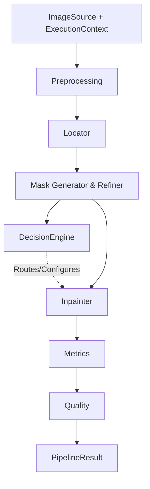

# LuxRestore-AI Architecture

## Overview
LuxRestore-AI follows a modular, dependency-injected Clean Architecture designed to support robust AI pipelines for image restoration.

## Data Flow
The core orchestration flows as follows:

## Core Abstractions

### Standardized Payloads
- **`ImageData`**: The universal internal representation of an image. Avoids locking into a specific library. `image: Any` allows NumPy, PIL, or Tensors to be passed seamlessly.
- **`ExecutionContext`**: Passed to every stage. Tracks `request_id`, `timings`, `device`, and configuration overrides, ensuring each module can log and profile itself without modifying global state.
- **`PipelineState`**: The heavy, internal state container maintained during a pipeline run.
- **`PipelineResult`**: The clean, decoupled payload returned to the API.

### Module Responsibilities
- **Preprocessing**: Converts Local Files, Base64, Bytes, or URLs into standard `ImageData`. Validates and Normalizes (e.g., standardizing rotation/channels).
- **Locator**: Detects objects (Watermarks, logos, etc.) yielding `RegionOfInterest` objects.
- **Mask Generator/Refiner**: Produces continuous or binary mask structures based on the localized regions.
- **Decision Engine**: Dynamically routes traffic based on internal state (e.g., triggering a heavier inpainter if a difficult region is detected).
- **Inpainter**: Reconstructs the image using the defined mask.
- **Metrics**: Computes LPIPS, SSIM, PSNR, runtime, and GPU load between original and processed data.
- **Quality Evaluator**: Provides business logic pass/fail validation.

---

## AI Provider Framework & Lifecycle

### Provider Lifecycle
AI Providers (e.g., `GroundingDINOProvider`, `Florence2Provider`) are registered at boot-up inside the `ProviderRegistry`. 
To avoid instantiating heavy machine learning models (loading weights, initializing PyTorch/CUDA) when registry information or metadata is queried, the lifecycle separates **Metadata Inspection** from **Inference**:
1. **Discovery / Metadata**: Call `@classmethod get_metadata()` on the class type without instantiating the class.
2. **On-Demand Instantiation**: The registry instantiates the provider type on-demand using `.get(provider_type)`. Heavy resources (like model weight loads) are loaded lazily during instantiation or during the first `.locate()` run.

### Registry & Factories
- **`ProviderRegistry`**: Dynamic storage of provider classes mapped by `ProviderType`. It exposes `list_providers()` which returns lightweight `ProviderMetadata` details for all candidates without triggering model initialization.
- **`LocatorFactory`**: Resolves which locator provider to use by querying the registry based on config.

### Capabilities
Every provider exposes `capabilities() -> dict[str, bool]` describing:
- Whether it supports GPU execution.
- Whether batch mode processing is supported.
- Whether it returns bounding boxes or segmentation masks.

The orchestrator and decision engine check these capabilities dynamically to decide on batch processing routes, GPU offloading, or masking strategies rather than hardcoding assumptions.

---

## APIs: Debug vs. Production

### Debug API (`POST /locate`)
- **Path**: `/locate`
- **Purpose**: Development/debugging endpoint.
- **Behavior**: Resolves the configured locator provider (`settings.locator_provider`), processes input through preprocessing to output `ImageData`, and runs ONLY the locator step. It returns raw `DetectionResult` (bounding boxes and labels) directly.
- **Design Intent**: Allows developers to sanity-check detection models, verify bounding box predictions, and test thresholds in isolation.

### Future Production API (`POST /restore` - Proposed)
- **Path**: `/restore`
- **Purpose**: Client-facing restoration API.
- **Behavior**: Executes the full pipeline (Preprocessing → Locator → Mask Gen/Refine → Decision Engine → Inpainter → Metrics → Quality).
- **Design Intent**: Decoupled from intermediate debug models, returning clean restored image data and standard validation flags.
